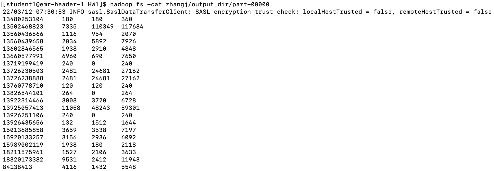

1. compile and run

bash run.sh

2. output

  hadoop fs -cat zhangj/output_dir/part-00000
  

3. comapre to input file

  diff <(hadoop fs -cat zhangj/input_dir/HTTP_20130313143750.dat | cut -f2,9,10 | awk -v OFS="\t" '{arr[$1]+=$2;brr[$1]+=$3;crr[$1]+=($2+$3)}END{for(i in arr) print i,arr[i],brr[i],crr[i]}' | sort -k1,1) <(hadoop fs -cat zhangj/output_dir/part-00000)

22/03/12 07:44:50 INFO sasl.SaslDataTransferClient: SASL encryption trust check: localHostTrusted = false, remoteHostTrusted = false
22/03/12 07:44:50 INFO sasl.SaslDataTransferClient: SASL encryption trust check: localHostTrusted = false, remoteHostTrusted = false
