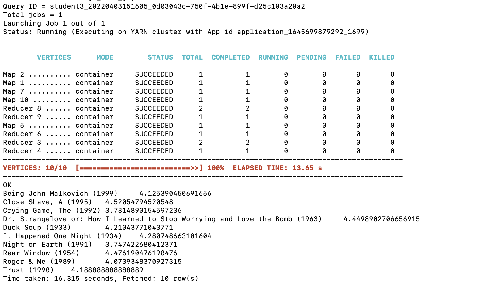

1. create tables

create external table t_rating_jz (userid int, movieid int, rate int, times bigint) row format serde 'org.apache.hadoop.hive.contrib.serde2.MultiDelimitSerDe' with serdeproperties ("field.delim"="::") stored as textfile location '/data/hive/rating';

create external table t_user_jz (userid int, sex string, age int, occupation int, zipcode int)  row format serde 'org.apache.hadoop.hive.contrib.serde2.MultiDelimitSerDe' with serdeproperties ("field.delim"="::") stored as textfile location '/data/hive/users';

create external table t_movie_jz (movieid int, moviename string, movietype string) row format serde 'org.apache.hadoop.hive.contrib.serde2.MultiDelimitSerDe' with serdeproperties ("field.delim"="::") stored as textfile location '/data/hive/movies';

2. 
problem 1

select u.age as age, avg(r.rate) as rate from (select userid, age from t_user_jz) u join (select userid, rate from t_rating_jz where t_rating_jz.movieid = 2116) r on (u.userid = r.userid) group by age order by age asc;

problem 2

select distinct top10.sex as sex, m.moviename as name, top10.avg_rate as avgrate, top10.n_times as total from (select movieid, moviename from t_movie_jz) m join (select movieid, sex, avg(rate) as avg_rate, count(times) as n_times from (select distinct u.userid, u.sex as sex, r.movieid as movieid, r.rate as rate, r.times as times from (select userid, sex from t_user_jz where sex = "M") u join (select userid, movieid, rate, times from t_rating_jz) r where (u.userid = r.userid)) ur group by movieid, sex having n_times > 50 order by avg_rate desc limit 10) top10 on (m.movieid = top10.movieid) order by avgrate desc;

problem 3

select m.moviename as moviename, ar.avg_rate as avg_rate from (select movieid, moviename from t_movie_jz) m join (select toprate.movieid as movieid, r.avg_rate as avg_rate from (select toptimes.userid as userid, r.movieid as movieid, r.rate as rate from (select userid, movieid, rate from t_rating_jz) r join (select u.userid as userid, u.sex as sex, r.times as times from (select userid, sex from t_user_jz where sex = "F") u join (select userid, count(*) as times from t_rating_jz group by userid) r on (u.userid = r.userid) order by times desc limit 1) toptimes on (toptimes.userid = r.userid) order by rate desc limit 10) toprate join (select movieid, avg(rate) as avg_rate from t_rating_jz group by movieid) r on (toprate.movieid = r.movieid)) ar on (m.movieid = ar.movieid) order by moviename asc;

3. drop tables

drop table t_rating_jz;

drop table t_user_jz;

drop table t_movie_jz;
