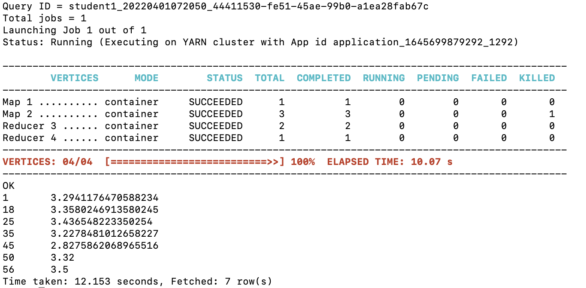
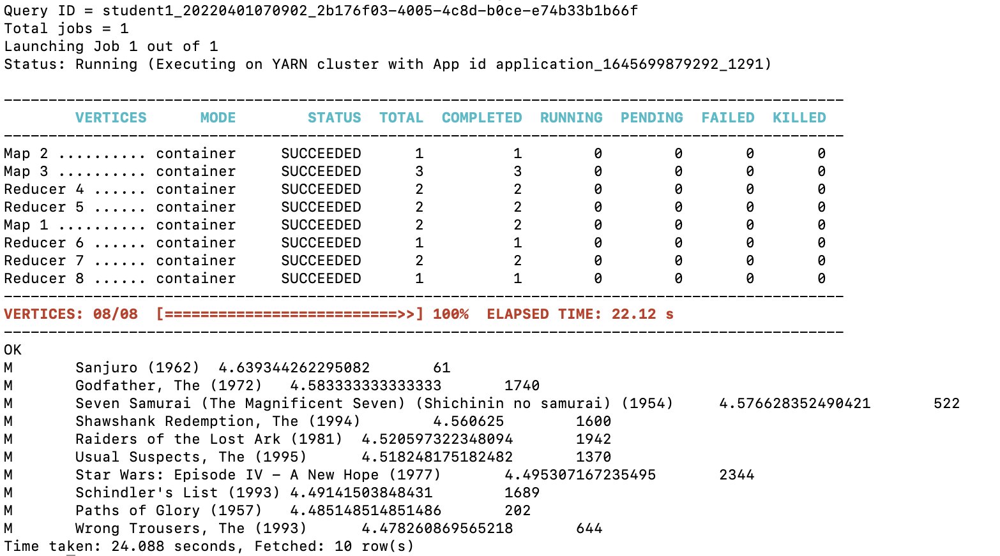

select u.age as age, avg(r.rate) as rate from (select user_id, age from t_user) u join (select userid, rate from t_rating where t_rating.movieid = 2116) r on (u.user_id = r.userid) group by age order by age asc;

select distinct top10.sex as sex, m.moviename as name, top10.avg_rate as avgrate, top10.n_times as total from (select movieid, moviename from t_movie) m join (select movieid, sex, avg(rate) as avg_rate, count(times) as n_times from (select distinct u.user_id, u.sex as sex, r.movieid as movieid, r.rate as rate, r.times as times from (select user_id, sex from t_user where sex = "M") u join (select userid, movieid, rate, times from t_rating) r where (u.user_id = r.userid)) ur group by movieid, sex having n_times > 50 order by avg_rate desc limit 10) top10 on (m.movieid = top10.movieid) order by avgrate desc;

