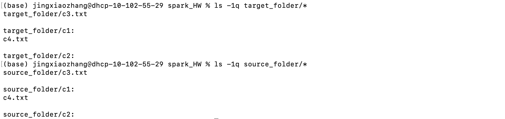

Problem 1

1. read in each file in input directory to a rdd of (word, file_number) and union those file rdds

2. create new rdd of (word, file_number) frequency => ((word, file_number), frequency) and reformat to (word, string(file_number, frequency))

3. reformat rdd and write to output

4. run jar file with 

spark-submit --class spark.zjx.invertedIndex target/spark.jar

5. output is 

Problem 2

1. parse options and store in Options

2. mkdir: go to the next folders and recursively make folders in target folder if there's any folder in source folders. If there's a file, store source filepath and target filepath in a tuple and append it to array

3. copyfile: use concurrence to parallelize the array and for each partition, copy files from tuple.source to tuple.target in the partition.

4. results

 
